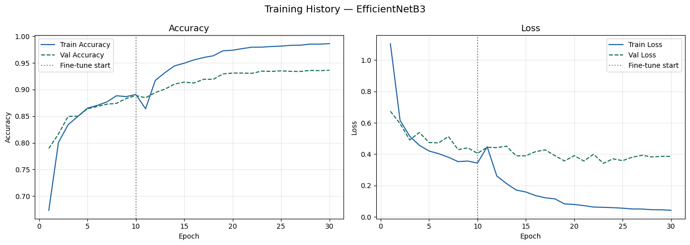
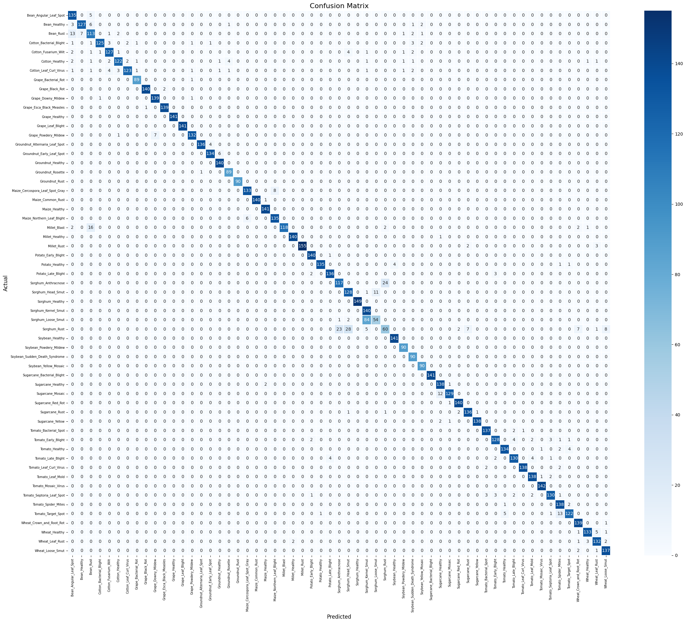

# Plant Disease Detector

A deep learning-based system for detecting plant diseases from leaf images using EfficientNetB3 and transfer learning.

---

## Dataset Overview

- Total Classes: 59  
- Total Images: 40,238  
- Images per Class: ~700 (balanced dataset)

### Key Features
- Multi-crop dataset (Tomato, Wheat, Sugarcane, Soybean, etc.)
- Includes both diseased and healthy leaves
- Augmented dataset to maintain class balance

---

## Dataset Structure

dataset_augmented/
│
├── Tomato_Early_Blight/
├── Tomato_Healthy/
├── Wheat_Leaf_Rust/
├── Sugarcane_Red_Rot/
├── ...
└── (59 folders total)

Each folder represents one class.

---

## Training Pipeline

The model was trained using Google Colab with GPU support.

### Environment

- TensorFlow 2.19  
- Python 3.x  
- GPU (Colab)

---

## Model Architecture

EfficientNetB3 (pretrained on ImageNet) is used as the backbone.

Architecture:

EfficientNetB3 (Base Model)
→ GlobalAveragePooling2D  
→ BatchNormalization  
→ Dense (512, ReLU)  
→ Dropout (0.4)  
→ Dense (256, ReLU)  
→ Dropout (0.3)  
→ Dense (59, Softmax)

Total Parameters: ~11.7 Million

---

## Training Strategy

### Data Preprocessing

- Image size: 224 × 224  
- Batch size: 32  
- Preprocessing: preprocess_input (EfficientNet)  
- Train/Validation split: 80% / 20%

---

### Phase 1: Transfer Learning

- Base model frozen  
- Only top layers trained  

Epochs: 10  
Learning Rate: 1e-3  

Result:
- Validation Accuracy: ~88.87%

---

### Phase 2: Fine-Tuning

- Unfreeze top 30 layers of EfficientNetB3  
- Lower learning rate  

Epochs: 20  
Learning Rate: 1e-4 (with ReduceLROnPlateau)

Callbacks Used:
- EarlyStopping  
- ReduceLROnPlateau  
- ModelCheckpoint  

---

## Final Results

- Final Validation Accuracy: 93.62%  
- Validation Loss: 0.3861  

### Evaluation

- Classification Report (Precision, Recall, F1-score)

- Confusion Matrix showing strong diagonal performance (high accuracy across classes)


---

## Model Saving

```python
model.save("plant_disease_model.keras")